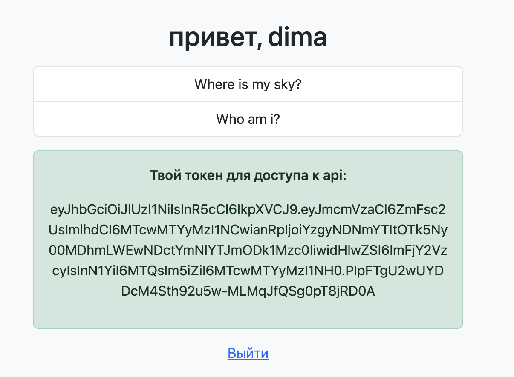

# Flask test app

## Переменные окружения:

**Для запуска проекта необходимо создать `.env` файл со следующими переменными окружения:**

1. Секретный ключ проекта `SECRET_KEY`, [документация](https://flask.palletsprojects.com/en/2.3.x/config/#SECRET_KEY)

2. `URI` базы данных, он же `SQLALCHEMY_DATABASE_URI`, [документация](https://flask-sqlalchemy.palletsprojects.com/en/2.x/config/)

Пример:

```sh 
postgresql://<db-user>:<db-user-password>@<db-ip-or-domain>:<port_number>/<database_name>
```

3. `CELERY_BROKER` - `uri` брокера для `celery`

Пример:

```sh 
redis://localhost
```

4. `CELERY_RESULT_BACKEND` - `uri` для хранения информации о задачах `celery`

5. `REDIS_PORT` и `REDIS_HOST` для соединения с бд `redis`
[документация](https://redis.io/)

**Переменные ниже нужно просто експортировать в окружение:**

Имя flask-приложения `FLASK_APP`:

```sh 
export FLASK_APP=<app_name>
```

Настройка дебага `FLASK_DEBUG`:

```sh 
export FLASK_DEBUG=1
```

## Настройка базы данных

**Для хранения записей и данных пользователей в проекте используется субд `postgresql`**

**Для хранения токена пользователя используется `redis`**
[Как установить](https://redis.io/docs/connect/clients/python/)

- Создайте бд `postgres`

```sql
CREATE DATABASE <database_name>;
CREATE USER <db_user> WITH ENCRYPTED PASSWORD <passwor_for_db>;
GRANT ALL PRIVELEGES ON DATABASE <database_name> TO <db_user>;
ALTER DATABASE <database_name> OWNER TO <database_user>;
```

- Убедитесь что `redis` работает

```sh 
redis-cli ping
```

## Фоновые процессы с использованием `celery`

Сервис использует 'celery' для бэкапа заметок всех пользователей

**Чтобы использовать `celery`**

- у вас должен быть установлен брокер задач `redis`
[документация](https://docs.celeryq.dev/en/stable/getting-started/backends-and-brokers/redis.html#broker-redis)

- Запущен `celery worker` 

```sh 
celery -A make_celery worker --loglevel INFO
```

- Запущен `celery beat` для бекапа

```sh 
celery -A make_celery beat --loglevel INFO
```

## Запуск сервиса

```sh 
flask run
```

### Тестирование `CRUD`

- Токен будет доступен после регистрации в сервисе



**Добавление записи**

```sh 
curl -X POST http://127.0.0.1:5000/api/entry \
  -H 'Authorization: Bearer <token>' \
  -H 'Content-Type: application/json' \
   -d '{"text": "<some_text>"}'
```

**Удаление записи**

```sh 
curl -X DELETE http://127.0.0.1:5000/api/entry/<entry_id> \
  -H 'Authorization: Bearer <token>' \
  -H 'Content-Type: application/json'
```

**Получение записей пользователя**

```sh 
curl -X GET http://127.0.0.1:5000/api/entries \
  -H 'Authorization: Bearer <token>' \
  -H 'Content-Type: application/json'
```

**Изменение записи**

```sh 
curl -X PUT http://127.0.0.1:5000/api/entry/<entry_id> \
  -H 'Authorization: Bearer <token>' \
  -H 'Content-Type: application/json' \
   -d '{"text": "<some_text>"}'
```
